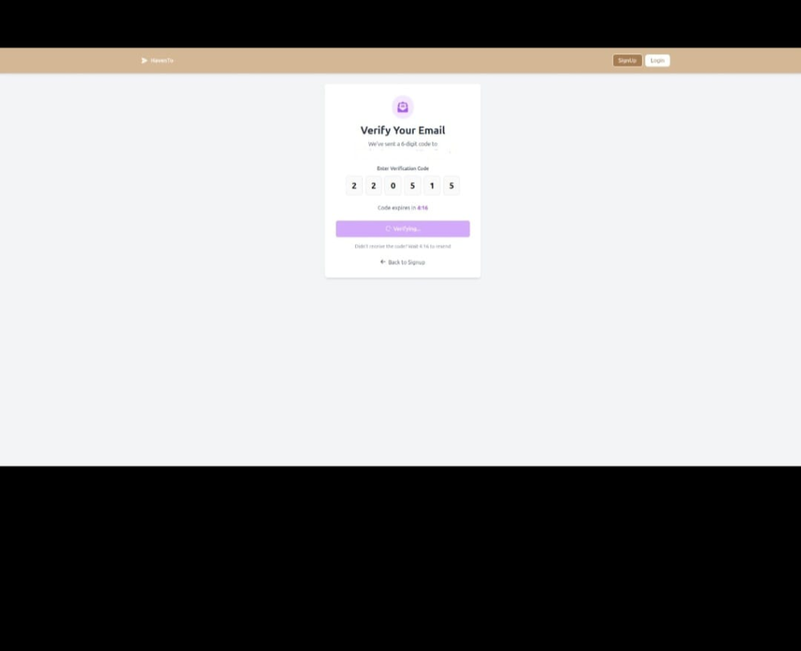
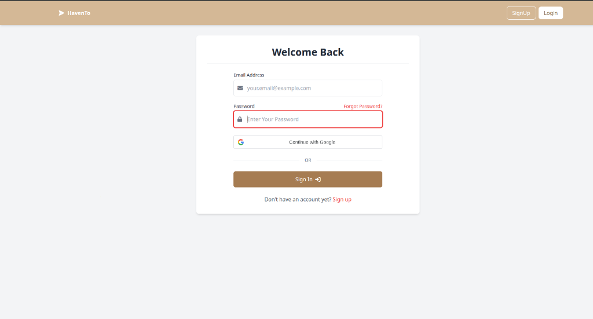
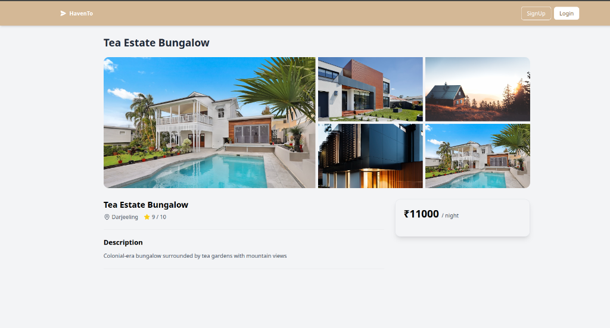

# HavenTo - Accommodation Booking Platform

A production-ready full-stack web application for booking accommodations with enterprise-level security features. Built with Node.js, Express, MongoDB, and React.

## 🌟 Features

### User Authentication & Security

- Email-based registration with OTP verification
- Secure password hashing with bcrypt (10 salt rounds)
- Session-based authentication with MongoDB session store
- Password reset functionality with secure tokens
- **DDoS Attack Protection** with rate limiting
- **Security headers** with Helmet.js
- **CORS protection** with environment-based origin validation

### For Guests

- Browse available properties
- View detailed property information with image galleries
- Add properties to favorites
- Book accommodations
- Manage bookings

### For Hosts

- List properties with multiple images
- Edit and manage listings
- Set pricing and availability
- View booking requests

### Core Functionality

- Image upload and management with Multer
- Search and filter properties
- Responsive design for all devices
- Real-time form validation
- Environment-based configuration for development and production

## 🛠️ Tech Stack

### Backend

- **Runtime**: Node.js
- **Framework**: Express.js
- **Database**: MongoDB with Mongoose ODM
- **Authentication**: express-session with connect-mongodb-session
- **Email**: Nodemailer (Gmail SMTP)
- **File Upload**: Multer
- **Security**:
  - bcryptjs for password hashing
  - express-rate-limit for DDoS protection
  - helmet for security headers
  - cors for cross-origin resource sharing

### Frontend

- **Framework**: React 18
- **Build Tool**: Vite
- **Routing**: React Router v6
- **HTTP Client**: Axios
- **Styling**: Tailwind CSS
- **Icons**: Font Awesome

## 🔒 Security Features

### DDoS Attack Protection

**Rate Limiting Implementation:**

- **OTP Endpoints**: 3 requests per 15 minutes per IP
- **Password Reset**: 3 requests per hour per IP
- **Authentication**: 5 attempts per hour per IP
- **General API**: 100 requests per 15 minutes per IP

**Protection Against:**

- Email spam attacks
- Brute force login attempts
- Resource exhaustion
- Server overload

### Security Headers (Helmet.js)

- X-Content-Type-Options: nosniff
- X-Frame-Options: DENY
- X-XSS-Protection: 1; mode=block
- Strict-Transport-Security (HSTS)
- Content-Security-Policy
- And 6 more security headers

### CORS Configuration

- Environment-based origin validation
- Credentials support for session cookies
- Production and development environment separation
- Blocks unauthorized cross-origin requests

### Additional Security

- Password hashing with bcrypt (10 salt rounds)
- Session-based authentication with secure cookies
- Email verification with OTP
- Password reset with time-limited secure tokens
- Input validation and sanitization
- Environment variable protection (.env files ignored)

## 📦 Installation

### Prerequisites

- Node.js (v14 or higher)
- MongoDB (local or Atlas)
- Gmail account (for email functionality)

### Backend Setup

1. Clone the repository:

```bash
git clone https://github.com/student-cse-lab/HavenTo-Accommodation-Booking-Platform-.git
cd HavenTo-Accommodation-Booking-Platform-
```

2. Install backend dependencies:

```bash
npm install
```

3. Create `.env` file in root directory:

```env
MONGODB_URI=mongodb://localhost:27017/havento
GMAIL_USER=your-email@gmail.com
GMAIL_APP_PASSWORD=your-app-password
FRONTEND_URL=http://localhost:5173
SESSION_SECRET=your-secret-key
PORT=3009
NODE_ENV=development
```

4. Start MongoDB (if running locally):

```bash
mongod
```

5. Start the backend server:

```bash
npm start
```

Server will run on `http://localhost:3009`

### Frontend Setup

1. Navigate to client directory:

```bash
cd client
```

2. Install frontend dependencies:

```bash
npm install
```

3. Create `.env` file in client directory:

```env
VITE_API_URL=http://localhost:3009
```

4. Start the development server:

```bash
npm run dev
```

Frontend will run on `http://localhost:5173`

## 🔐 Environment Variables

### Backend (.env)

```env
MONGODB_URI=mongodb://localhost:27017/havento
GMAIL_USER=your-email@gmail.com
GMAIL_APP_PASSWORD=your-gmail-app-password
FRONTEND_URL=http://localhost:5173
SESSION_SECRET=your-session-secret
PORT=3009
NODE_ENV=development
```

### Frontend (client/.env)

```env
VITE_API_URL=http://localhost:3009
```

### Getting Gmail App Password

1. Enable 2-Factor Authentication on your Google account
2. Go to Google Account Settings → Security
3. Under "Signing in to Google", select "App passwords"
4. Generate a new app password for "Mail"
5. Use this password in `GMAIL_APP_PASSWORD`

## 📁 Project Structure

```
├── client/                     # React frontend
│   ├── src/
│   │   ├── components/        # Reusable components
│   │   ├── config/            # API configuration
│   │   ├── context/           # React Context (Auth)
│   │   ├── pages/             # Page components
│   │   ├── services/          # API services
│   │   └── App.jsx            # Main app component
│   ├── .env.example           # Frontend environment template
│   └── package.json
├── controllers/               # Route controllers
├── middleware/                # Custom middleware
│   ├── rateLimiter.js        # DDoS protection
│   └── auth.js               # Authentication middleware
├── models/                    # Mongoose models
├── routes/                    # Express routes
├── utils/                     # Utility functions
├── uploads/                   # User uploaded images
├── .env.example              # Backend environment template
├── .gitignore                # Git ignore rules
├── app.js                    # Express app setup
└── package.json
```

## 🚀 Usage

1. **Sign Up**: Create an account as a Guest or Host
2. **Verify Email**: Enter the OTP sent to your email
3. **Browse Properties**: Explore available accommodations
4. **Book**: Select dates and book a property (Guest)
5. **List Property**: Add your property for booking (Host)

## 🌐 Deployment

### Production Deployment

**Frontend**: Deploy to Vercel

- Framework: Vite
- Root Directory: `client`
- Build Command: `npm run build`
- Output Directory: `dist`
- Environment Variable: `VITE_API_URL=https://your-backend-url.com`

**Backend**: Deploy to Render.com or AWS EC2

- Build Command: `npm install`
- Start Command: `npm start`
- Environment Variables: See `.env.example`

**Database**: MongoDB Atlas (Cloud)

For detailed deployment instructions, see `DEPLOYMENT_GUIDE.md`

## 📊 Rate Limiting Details

| Endpoint Type     | Limit        | Window     | Purpose             |
| ----------------- | ------------ | ---------- | ------------------- |
| OTP (Email/Phone) | 3 requests   | 15 minutes | Prevent email spam  |
| Password Reset    | 3 requests   | 1 hour     | Prevent abuse       |
| Authentication    | 5 requests   | 1 hour     | Prevent brute force |
| General API       | 100 requests | 15 minutes | Prevent DDoS        |

## 🛡️ Security Best Practices

- ✅ Never commit `.env` files to Git
- ✅ Use environment variables for all sensitive data
- ✅ Keep dependencies updated
- ✅ Use HTTPS in production
- ✅ Implement rate limiting on all public endpoints
- ✅ Validate and sanitize all user inputs
- ✅ Use secure session configuration
- ✅ Enable CORS only for trusted origins

## 📸 Screenshots

### Homepage


_Browse available properties with search and filter functionality_

### Sign Up


_Create an account as a Guest or Host with email verification_

### Email Verification


_Enter 6-digit OTP code sent to your email_

### Login


_Secure login with session-based authentication_

### Property Details


_View detailed property information with image gallery_

## 🤝 Contributing

Contributions are welcome! Please follow these steps:

1. Fork the repository
2. Create your feature branch (`git checkout -b feature/AmazingFeature`)
3. Commit your changes (`git commit -m 'Add some AmazingFeature'`)
4. Push to the branch (`git push origin feature/AmazingFeature`)
5. Open a Pull Request

## 📝 License

This project is licensed under the MIT License - see the [LICENSE](LICENSE) file for details.

## 👨‍💻 Author

**Saurabh Kumar**

- Email: saurabhrajput.25072005@gmail.com
- GitHub: [@student-cse-lab](https://github.com/student-cse-lab)

## 🙏 Acknowledgments

- Inspired by Airbnb
- Built with modern web development best practices
- Thanks to the open-source community for amazing tools and libraries

## 📞 Support

For support, email saurabhrajput.25072005@gmail.com or open an issue in the repository.

## 🔧 Troubleshooting

### Common Issues

**CORS Error:**

- Verify `FRONTEND_URL` in backend `.env` matches your frontend URL
- Check CORS configuration in `app.js`

**Rate Limit Error:**

- Wait for the rate limit window to reset
- Check `middleware/rateLimiter.js` for current limits

**MongoDB Connection Error:**

- Verify MongoDB is running
- Check `MONGODB_URI` in `.env`
- For MongoDB Atlas, whitelist your IP address

**Email Not Sending:**

- Verify Gmail App Password is correct
- Check `GMAIL_USER` and `GMAIL_APP_PASSWORD` in `.env`
- Ensure 2FA is enabled on Gmail account

---

**Production Ready**: This application includes enterprise-level security features and is ready for production deployment with proper environment configuration.
# Last updated: Tue Jan 13 05:42:07 PM IST 2026
