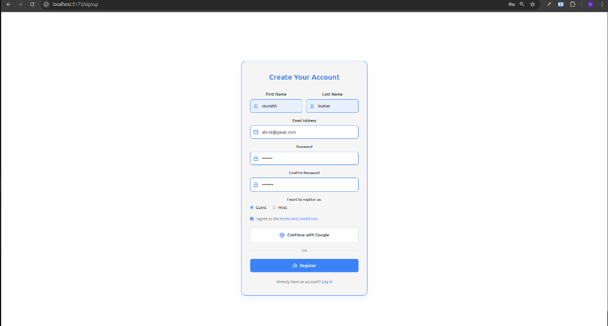
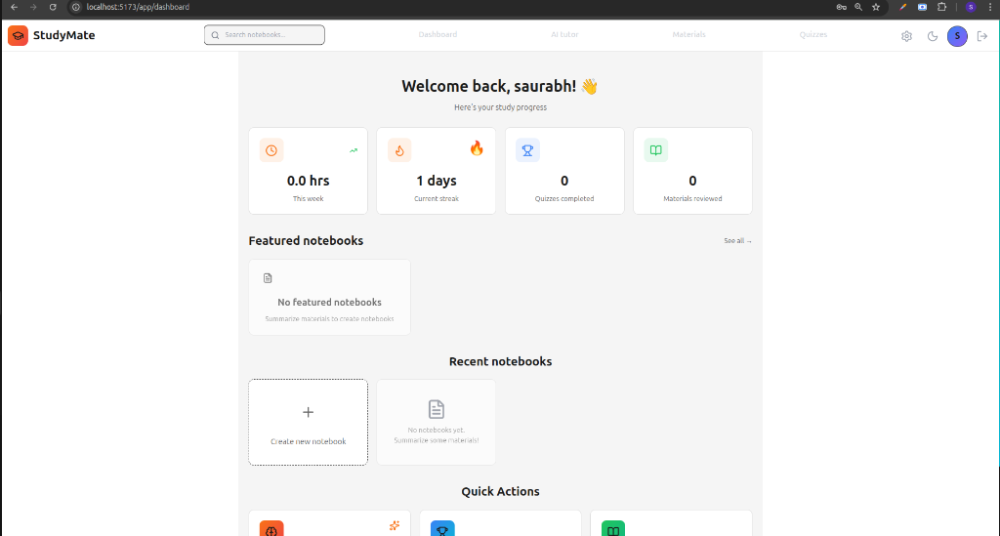
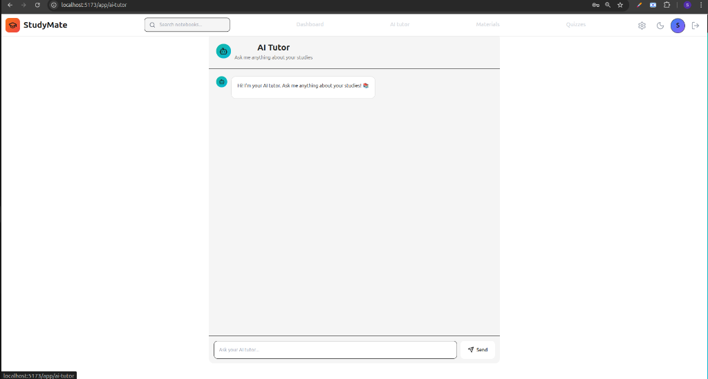
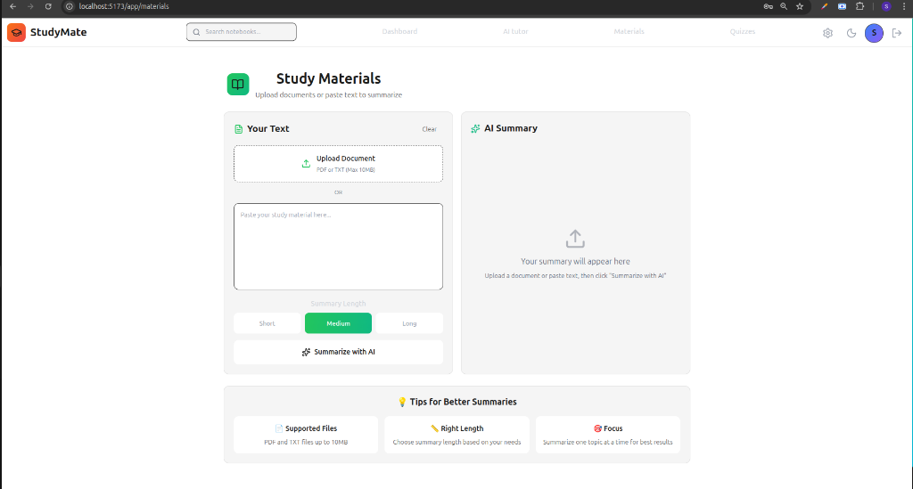

# StudyMate - AI-Powered Study Platform

A production-ready full-stack web application that revolutionizes learning with AI-powered tutoring, smart material summarization, interactive quizzes, and personalized study analytics. Built with Node.js, Express, MongoDB, React, and Google Gemini AI.

## 🌟 Features

### AI-Powered Learning

- **AI Tutor**: Interactive chat with Google Gemini AI for personalized learning assistance
- **Smart Summarization**: Upload study materials (PDF, DOCX, TXT) and get AI-generated summaries
- **Quiz Generation**: Automatically generate quizzes from your study materials
- **Intelligent Notebook**: AI-enhanced note-taking with smart suggestions

### User Authentication & Security

- Email-based registration with OTP verification
- Secure password hashing with bcrypt (10 salt rounds)
- Session-based authentication with MongoDB session store
- Password reset functionality with secure tokens
- **DDoS Attack Protection** with rate limiting
- **Security headers** with Helmet.js
- **CORS protection** with environment-based origin validation

### Study Analytics & Gamification

- **Study Streak Tracking**: Monitor daily learning consistency
- **Time Tracking**: Track total and weekly study time
- **Progress Dashboard**: Visualize learning progress with charts
- **Activity Metrics**: Track quizzes completed, materials reviewed, and AI conversations
- **Personalized Insights**: Get AI-powered study recommendations

### Core Functionality

- Document upload and processing (PDF, DOCX, TXT)
- Real-time AI chat interface
- Interactive quiz system with instant feedback
- Material library management
- Responsive design for all devices
- Dark/Light theme support
- Environment-based configuration for development and production

## � Screenshots

### Homepage


_Landing page with AI-powered study features_

### Sign Up


_User registration with email verification_

### Dashboard


_Personalized dashboard with study analytics and progress tracking_

### AI Tutor


_Interactive AI chat for personalized learning assistance_

### Study Materials


_Upload and summarize study materials with AI_

## �🛠️ Tech Stack

### Backend

- **Runtime**: Node.js
- **Framework**: Express.js
- **Database**: MongoDB with Mongoose ODM
- **AI Integration**: Google Gemini AI API
- **Authentication**: express-session with connect-mongodb-session
- **Email**: Resend API for transactional emails
- **File Upload**: Multer
- **Document Processing**:
  - pdf-parse for PDF files
  - mammoth for DOCX files
- **Security**:
  - bcryptjs for password hashing
  - express-rate-limit for DDoS protection
  - helmet for security headers
  - cors for cross-origin resource sharing

### Frontend

- **Framework**: React 18
- **Build Tool**: Vite
- **Routing**: React Router v6
- **HTTP Client**: Axios
- **Styling**: Tailwind CSS
- **Icons**: Font Awesome
- **Charts**: Recharts for analytics visualization

## 🔒 Security Features

### DDoS Attack Protection

**Rate Limiting Implementation:**

- **OTP Endpoints**: 3 requests per 15 minutes per IP
- **Password Reset**: 3 requests per hour per IP
- **Authentication**: 5 attempts per hour per IP
- **General API**: 100 requests per 15 minutes per IP

**Protection Against:**

- Email spam attacks
- Brute force login attempts
- Resource exhaustion
- Server overload

### Security Headers (Helmet.js)

- X-Content-Type-Options: nosniff
- X-Frame-Options: DENY
- X-XSS-Protection: 1; mode=block
- Strict-Transport-Security (HSTS)
- Content-Security-Policy
- And 6 more security headers

### CORS Configuration

- Environment-based origin validation
- Credentials support for session cookies
- Production and development environment separation
- Blocks unauthorized cross-origin requests

### Additional Security

- Password hashing with bcrypt (10 salt rounds)
- Session-based authentication with secure cookies
- Email verification with OTP
- Password reset with time-limited secure tokens
- Input validation and sanitization
- Environment variable protection (.env files ignored)

## 📦 Installation

### Prerequisites

- Node.js (v14 or higher)
- MongoDB (local or Atlas)
- Google Gemini API Key
- Resend API Key (for email functionality)

### Backend Setup

1. Clone the repository:

```bash
git clone https://github.com/yourusername/StudyMate.git
cd StudyMate
```

2. Install backend dependencies:

```bash
npm install
```

3. Create `.env` file in root directory:

```env
MONGODB_URI=mongodb://localhost:27017/studymate
GEMINI_API_KEY=your-gemini-api-key
RESEND_API_KEY=your-resend-api-key
FRONTEND_URL=http://localhost:5173
SESSION_SECRET=your-secret-key
PORT=3009
NODE_ENV=development
```

4. Start MongoDB (if running locally):

```bash
mongod
```

5. Start the backend server:

```bash
npm start
```

Server will run on `http://localhost:3009`

### Frontend Setup

1. Navigate to client directory:

```bash
cd client
```

2. Install frontend dependencies:

```bash
npm install
```

3. Create `.env` file in client directory:

```env
VITE_API_URL=http://localhost:3009
```

4. Start the development server:

```bash
npm run dev
```

Frontend will run on `http://localhost:5173`

## 🔐 Environment Variables

### Backend (.env)

```env
MONGODB_URI=mongodb://localhost:27017/studymate
GEMINI_API_KEY=your-gemini-api-key
RESEND_API_KEY=your-resend-api-key
FRONTEND_URL=http://localhost:5173
SESSION_SECRET=your-session-secret
PORT=3009
NODE_ENV=development
```

### Frontend (client/.env)

```env
VITE_API_URL=http://localhost:3009
```

### Getting API Keys

**Google Gemini API Key:**

1. Go to [Google AI Studio](https://makersuite.google.com/app/apikey)
2. Sign in with your Google account
3. Click "Create API Key"
4. Copy the API key and use it in `GEMINI_API_KEY`

**Resend API Key:**

1. Sign up at [Resend](https://resend.com)
2. Go to API Keys section
3. Create a new API key
4. Copy the API key and use it in `RESEND_API_KEY`

## 📁 Project Structure

```
├── client/                     # React frontend
│   ├── src/
│   │   ├── components/        # Reusable components
│   │   ├── config/            # API configuration
│   │   ├── context/           # React Context (Auth, Theme)
│   │   ├── pages/             # Page components
│   │   │   ├── auth/          # Authentication pages
│   │   │   ├── Dashboard.jsx  # Main dashboard
│   │   │   ├── AITutor.jsx    # AI chat interface
│   │   │   ├── Materials.jsx  # Study materials
│   │   │   └── Quiz.jsx       # Quiz interface
│   │   ├── services/          # API services
│   │   └── App.jsx            # Main app component
│   ├── .env.example           # Frontend environment template
│   └── package.json
├── controllers/               # Route controllers
│   ├── authController.js      # Authentication logic
│   ├── emailVerificationController.js
│   ├── passwordResetController.js
│   └── storeController.js
├── middleware/                # Custom middleware
│   ├── rateLimiter.js        # DDoS protection
│   └── auth.js               # Authentication middleware
├── models/                    # Mongoose models
│   ├── user.js               # User model with stats
│   └── notebook.js           # Notebook model
├── routes/                    # Express routes
│   ├── authRouter.js
│   ├── aiRoutes.js           # AI tutor endpoints
│   ├── materialRoutes.js     # Material upload/summary
│   ├── statsRoutes.js        # User analytics
│   └── notebookRoutes.js     # Notebook CRUD
├── utils/                     # Utility functions
│   ├── geminiService.js      # Google Gemini integration
│   ├── otpService.js         # Email OTP service
│   └── otpStorage.js         # In-memory OTP storage
├── uploads/                   # User uploaded documents
├── .env.example              # Backend environment template
├── .gitignore                # Git ignore rules
├── app.js                    # Express app setup
└── package.json
```

## 🚀 Usage

1. **Sign Up**: Create an account with email verification
2. **Verify Email**: Enter the OTP sent to your email
3. **Dashboard**: View your study statistics and progress
4. **AI Tutor**: Chat with AI for personalized learning help
5. **Upload Materials**: Upload PDFs, DOCX, or TXT files for AI summarization
6. **Take Quizzes**: Generate and take quizzes from your materials
7. **Track Progress**: Monitor your study streaks and time spent learning

## 🌐 Deployment

### Production Deployment

**Frontend**: Deploy to Vercel

1. Push your code to GitHub
2. Connect your repository to Vercel
3. Configure build settings:
   - Framework: Vite
   - Root Directory: `client`
   - Build Command: `npm run build`
   - Output Directory: `dist`
4. Add environment variable:
   - `VITE_API_URL=https://your-backend-url.onrender.com`

**Backend**: Deploy to Render.com

1. Create a new Web Service on Render
2. Connect your GitHub repository
3. Configure settings:
   - Build Command: `npm install`
   - Start Command: `npm start`
   - Environment: Node
4. Add environment variables (see `.env.example`)
5. Deploy!

**Database**: MongoDB Atlas (Cloud)

1. Create a free cluster at [MongoDB Atlas](https://www.mongodb.com/cloud/atlas)
2. Get your connection string
3. Add it to `MONGODB_URI` in Render environment variables
4. Whitelist Render's IP addresses (or use 0.0.0.0/0 for all IPs)

## 📊 Rate Limiting Details

| Endpoint Type  | Limit        | Window     | Purpose             |
| -------------- | ------------ | ---------- | ------------------- |
| OTP (Email)    | 3 requests   | 15 minutes | Prevent email spam  |
| Password Reset | 3 requests   | 1 hour     | Prevent abuse       |
| Authentication | 5 requests   | 1 hour     | Prevent brute force |
| General API    | 100 requests | 15 minutes | Prevent DDoS        |

## 🤝 Contributing

Contributions are welcome! Please follow these steps:

1. Fork the repository
2. Create your feature branch (`git checkout -b feature/AmazingFeature`)
3. Commit your changes (`git commit -m 'Add some AmazingFeature'`)
4. Push to the branch (`git push origin feature/AmazingFeature`)
5. Open a Pull Request

## 📝 License

This project is licensed under the MIT License - see the [LICENSE](LICENSE) file for details.

## 👨‍💻 Author

**Saurabh Kumar**

- Email: saurabhrajput.25072005@gmail.com
- GitHub: [@saurabh-Kumar135](https://github.com/saurabh-Kumar135)

## 🙏 Acknowledgments

- Powered by Google Gemini AI
- Built with modern web development best practices
- Thanks to the open-source community for amazing tools and libraries

## 📞 Support

For support, email saurabhrajput.25072005@gmail.com or open an issue in the repository.

## 🔧 Troubleshooting

### Common Issues

**CORS Error:**

- Verify `FRONTEND_URL` in backend `.env` matches your frontend URL
- Check CORS configuration in `app.js`

**Rate Limit Error:**

- Wait for the rate limit window to reset
- Check `middleware/rateLimiter.js` for current limits

**MongoDB Connection Error:**

- Verify MongoDB is running
- Check `MONGODB_URI` in `.env`
- For MongoDB Atlas, whitelist your IP address

**Email Not Sending:**

- Verify Resend API Key is correct
- Check `RESEND_API_KEY` in `.env`
- Ensure you're using a verified domain (or use onboarding@resend.dev for testing)

**AI Tutor Not Working:**

- Verify Gemini API Key is correct
- Check `GEMINI_API_KEY` in `.env`
- Ensure you have API quota available

**File Upload Issues:**

- Check file size limits (default: 10MB)
- Verify supported formats: PDF, DOCX, TXT
- Ensure `uploads/` directory exists and has write permissions

---

**Production Ready**: This application includes enterprise-level security features, AI integration, and is ready for production deployment with proper environment configuration.

**Last updated**: January 19, 2026
